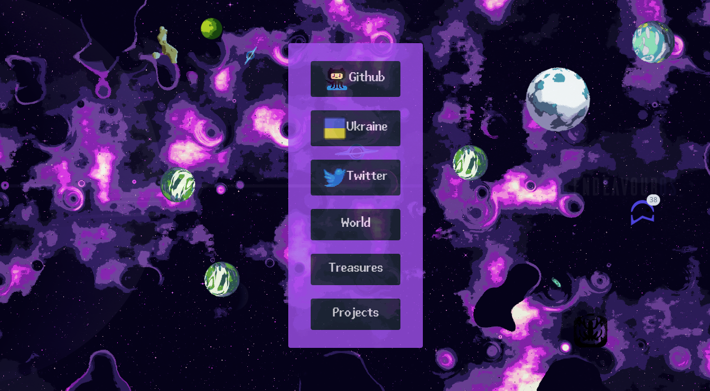

### Welcome to my multiverse

The first universe you come across is just the beginning; a “front-end”, if you will. But that's only the start; there are many other universes out there, all connected to each other. The possibilities are endless; the only limit is my creativity. With the right vision and fortuity, I will do my best to show you one of the most stunning multiverses.

### Why … headless UI and TailwindCss?

Every React/CSS system is good, such as BootStrap, MUI, or even Jetbrain Ring-ui. I owe them so much. I just want to find tools that keep me as close to the basics as possible. I don't want to be confined to any "standard".

